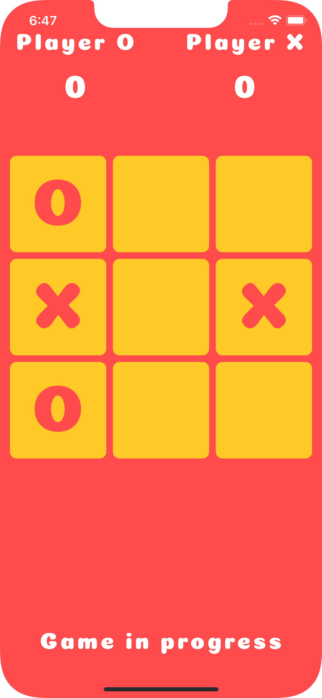
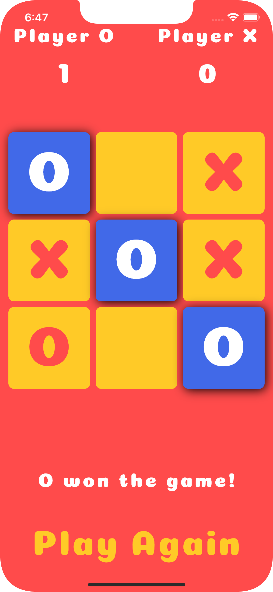

<!-- PROJECT LOGO -->
<br />
<p align="center">
  <a href="https://github.com/YahyaBagia/TicTacToe-Flutter/">
    <p>
      <strong><h1 align="center">⭐ Tic-Tac-Toe ⭐</h1></strong>
    </p>
  </a>
  <p align="center">
    <a href="https://yahyabagia.github.io/TicTacToe-Flutter/">View Demo</a>
     · 
    <a href="https://github.com/YahyaBagia/TicTacToe-Flutter/issues/">Report Bug</a>
  </p>
</p>

<!-- TABLE OF CONTENTS -->

## Table of Contents

- [Table of Contents](#table-of-contents)
- [About The Project](#about-the-project)
- [Getting Started](#getting-started)
  - [Prerequisites](#prerequisites)
  - [Setup](#setup)
- [Contributing](#contributing)

<!-- ABOUT THE PROJECT -->

## About The Project

<table>
<tr>
<td></td>
<td></td>
</tr>
</table>

A simple Tic-Tac-Toe game to be played against another player. While there are greate implementations of Tic-Tac-Toe are available on the internet, mine is just a small contribution to the open source communitity. It was made as a part of me practicing [Flutter](https://flutter.dev/) with [dart](https://dart.dev/).

<!-- GETTING STARTED -->

## Getting Started

You can try out this project on the [web](https://yahyabagia.github.io/TicTacToe-Flutter/) or follow the instructions below to setup it up for yourself.

### Prerequisites

Make sure you have the following CLIs installed on your machine.

- Flutter : Click [here](https://docs.flutter.dev/get-started/install) to learn more.

### Setup

1. Clone the repo

```sh
git clone https://github.com/YahyaBagia/TicTacToe-Flutter.git
```

2. Run the App

- Web : `flutter run -d chrome`
- Android : `Use Android Studio / VSCode`
- iOS : `Use XCode / VSCode`

3. For more Flutter commands

- Visit [Flutter Docs](https://docs.flutter.dev/reference/flutter-cli).

<!-- CONTRIBUTING -->

## Contributing

Contributions are what make the open source community such an amazing place to be learn, inspire, and create. Any contributions you make are **greatly appreciated**.

1. Fork the Project
2. Create your Feature Branch (`git checkout -b feature/AmazingFeature`)
3. Commit your Changes (`git commit -m 'Add some AmazingFeature'`)
4. Push to the Branch (`git push origin feature/AmazingFeature`)
5. Open a Pull Request
